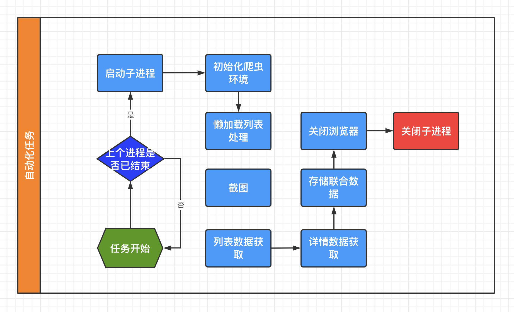

# 基于puppeteer的Node爬虫应用

#### 为什么选puppeteer
* 生成网页的长截屏
* 爬取异步渲染网页
* 自动表单提交、键盘输入、模拟请求，ua，viewport等
* 创建最新的自动测试环境，也就是说可以使用最新的浏览器特性
* 捕获站点的时间线以帮助分析性能问题

#### 目标站点
* 京喜栏目及详情
    * 直播栏目懒加载处理
    * 直播栏目长屏截图
    * 直播中列表/详情数据获取&解析

#### 涉及Node模块
* 【cronJob】- 自动化任务
* 【child_process】- 子进程管理
* 【puppeteer】- 爬虫环境搭建，截图
* 【cheerio】- 数据解析
* 【fs，mongoose】- 数据存储

#### 流程示意图



#### 效果预览
```node
1. cd  /Users/jixiaojiao3/codes/puppeteer-test
2. node app.js
```
#### 代码分享
重实践，轻设计
```node
./app.js
./task.js
```

#### 思考
* 自动化测试
    > 1：跳转，图片链接是否有效
    > 2：是否存在异常字段（价格负值，栏目直播间观看人数差异大）
    > 3：直播是否已断流
    > 4：模拟UA，Viewport查看多端，多屏幕分辨率下截图效果
    > 5：直播页面性能分析（DOM节点数，布局总数，样式重算数，所有脚本执行的持续时间，JavaScript占用堆大小，JavaScript 堆总量）
#### 谢谢，下次再见
